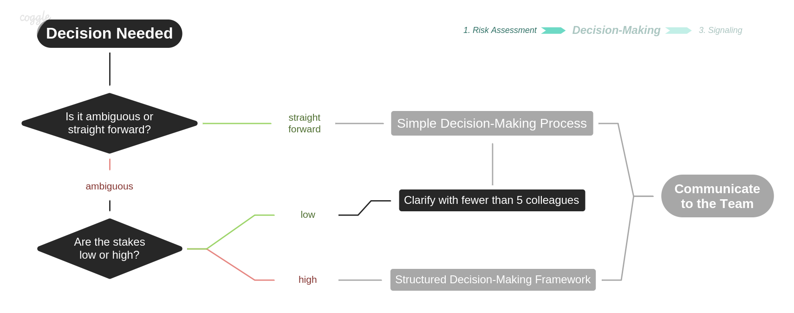

# Risk Assessment

## What does it looks like?

The scenario is ubiquitous: either you don’t have enough information to feel certain you’re making the right decision or you don’t know you’re missing key information.

#### Ambiguity

* If you're wondering about a needed decision, then there is some ambiguous already. 
* If such decision has never been made before by the organization, then is ambiguity even if another org elsewhere have tried it.
* Double check assumptions, some things taken by granted end up harboring ambiguity and hindering opportunities \(e.g. polls, surveys, votes should follow a template and/or be validated before launching\)
* How long will we be committed to the decision? 
* High stakes? Ambiguous.

#### High Stakes/Risk

Higher risk can mean that the decision has long term implications or that it can be costly to unwind if the wrong decision is made. Another way to look at it is about its impact \(i.e. what is at stake\), how many people affected inside and/or outside the organization.

* How long will we be committed to the decision?
* Will it involve inputs from member and/or entities elsewhere?
* How much will it impact the rest of the team?


High **risk** means higher chance for trouble, while high **stakes** means there is much to lose if in trouble.


## Risk x Ambiguity X Loss


TLDR; Here both **risk** **aversion** and **ambiguity** **aversion** are sought and desired. While **loss aversion** should not hinder a well **screened** opportunity. 


> There are known knowns; there are things that we know that we know. We also know there are known unknowns; that is to say we know there are some things we do not know. But there are also unknown unknowns, the ones we don’t know we don’t know.

We refer to the quantifiable part of uncertainty \(or the known unknown\) as **risk**. The non-quantifiable component of uncertainty \(or the unknown unknown\) may be considered to be **ambiguity**. **Loss** is what happens when risk meets adversity. 

### Risk Aversion x Ambiguity Aversion x Loss Aversion

> If an hypothetical Russian roulette were to offer, with its ~83% of success, awarding its winner with the keys to Satoshi's Genesis wallet, would you join?

**Risk-averse** decision makers should be interested not only in expected values but also in the variances of outcome variables - _e.g. 1/6 chance of death in each Russian Roulette round should be unbearable no matter the prize_.  

While **ambiguity aversion** is a preference for known risks over unknown risks. **Loss aversion** refers to people's tendency to prefer avoiding losses to acquiring equivalent gains. 



## Information Asymmetry 


Information Asymmetry sucks and often leads to [bad outcomes](https://www.jofreeman.com/joreen/tyranny.htm). We should fight it both at systemic and atomic levels. [Signalling and screening games](signaling.md) are proposed further on but either way beware the dangers of **moral hazards**.


**Adverse selection** is a term commonly used in economics, insurance, and risk management that describes a situation where participation is affected by asymmetric information.  
M**oral hazard** occurs when someone increases their exposure to risk when insured, especially when a person takes more risks because someone else bears the cost of those risks.

_For example, with respect to the originators of_ [_subprime loans_](https://en.wikipedia.org/wiki/Subprime_loans)_, many may have suspected that the borrowers would not be able to maintain their payments in the long run and that, for this reason, the loans were not going to be worth much. Still, because there were many buyers of these loans \(or of pools of these loans\) willing to take on that risk, the originators did not concern themselves with the potential long-term consequences of making these loans. After selling the loans, the originators bore none of the risk so there was little to no incentive for the originators to investigate the long-term value of the loans._

\*\*\*\*

