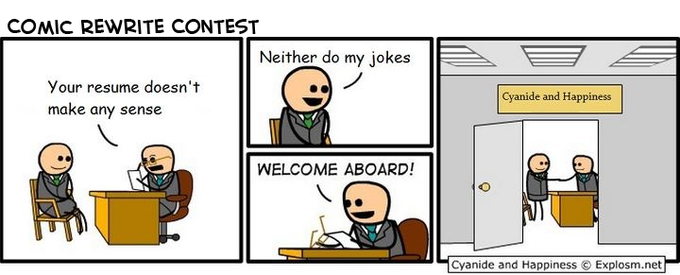

# Signaling


After [assessing](risk-assessment.md) and [deciding](./), it is time to make sure that the **rationale** \(either in a explicit or contextual manner\), the actual **decision** and it's **implications** \(be it with simple bread-crumbs or a proposal document\) are properly signaled.


> "If we can’t report well, we don’t pursue."   
> @nonprofitbecky

### **Communication is critical to the process.**

> A decision is not complete until all impacted by that decision are notified. if you'd never abandon a puppy, why abandon decisions outputs? Think about the puppies.

The decision-maker is accountable for determining the best format to deliver this communication. For example, if everybody is highly impacted, an email to all employees may be the best way to communicate the decision. If nobody is directly impacted today, an FYI in a slack channel and a note in a design doc may be sufficient.

#### Decisions outputs

_What are they and where do they go after decisions have been made?_

Documentation, Logs, notifications to impacted parties. Well, from now on, we should house them here in this neat piece of the cyberspace. 

## KISS \(Keep It Small and Simple[\*](https://www.interaction-design.org/literature/topics/keep-it-simple-stupid)\)

If a decision is both small & simple / straightforward & low stakes then it should be anchored to an clear actionable. If not all, most actionables should be listed on our [kanban board](https://trello.com/b/XrAjqdlO/dao-incubator). Thus, our most reliable rule of thumb for simple decision making is:

1. Find/create a card 
2. Change the card
3. Validate with peers
4. Have fun, drink water

 Otherwise it is suggested:

* Clearly delegate the actual trello card interaction to someone else
* If absolutely incompatible with kanban/trello, just write something on Discord

## Structured Decisions

Gladly their structure are more then mere pain in the ass and should have an automated log and/or archive of decisions and interactions. 

## Where?

* **Decisions** have [Arenas](signaling.md#arenas)
* **Communications** have [Channels](signaling.md#channels)
* and **Artifacts** & **Assets** have [Environments](signaling.md#environments)

## Arenas

* **Integrative Decision Making**[**\***](https://docs.google.com/document/d/11QyCfUZVveBDw2Mib8jFKiM-mBZHNbNAbaBve5EylGY/edit?usp=sharing) ****
  * Calls
    * Tacticals
  * Trello cards
* **Loomio**
  * Threads
    * Proposal
    * Check
    * Poll
    * Dot
    * Score
    * Time Poll
    * Ranked Choice


**Pre-proposal**: ****1\) Find a minimal viable number of participants necessary to justify the use of censorship resistant Web3 tools such as Aragon and Alchemy; 2\) Prepare for when the time comes; 3\) Keep using legacy/offchain tools until then;


## Channels

* Telegram
  * Core group
  * WG group
  * Public channel
* Discord
  * \[Discord Architecture proposal\]
* Calls
  * Core 
  * WG
* More?

## Environments

An **environment** or **tier** is a system in which a process or component is deployed and accessible. In simple cases there may be a single environment, but in uses at scale the development environment \(where changes are originally made\) and production environment \(what end users use\) are separated; often with several stages in between. This structured release management process allows phased deployment \(rollout\), testing, and rollback in case of problems.

These normally break down as follows:

### **Development**: 

[_GDrive folder_](https://drive.google.com/drive/folders/11Dcr_kgeR_lPenmb1hdT72rbYvVMrqX7)_, mostly_  
Working In Progress, new documents, drafts, sketches are deployed here so collaboration and feedback may happen. This environment is rapidly updated and contains the most recent version of our work.

### **Staging**:

_You are here_  
This is the release candidate, and this environment is normally a mirror of the production environment. The staging area contains the "stable" versions and pre approved documentation and is used for final stress testing and voting/approvals before going live.

### **Production**: 

_Our_ [_public gitbook_](https://dao-incubator.gitbook.io/)  
This is the currently released version of our work, accessible to the community/end users. This version preferably does not change except for during scheduled releases.

## Signaling and screening games

